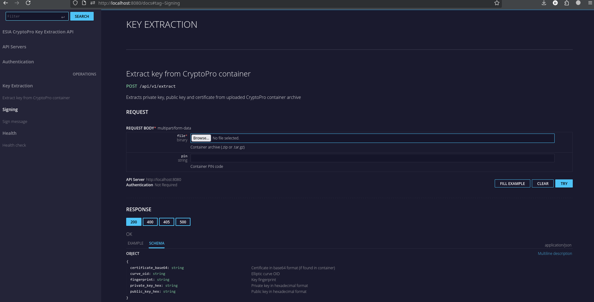

# ESIA oAuth клиент на Go

Две версии README:

🇷🇺 [Русский](README.md) | 🇺🇸 [English](README_en.md)

Попытка сделать нативную реализацию oAuth через ЕСИА с поддержкой криптографии по ГОСТ.
Без готовых Docker сборок с пропатченным OpenSSL или внешних зависимостей от OpenSSL как такового.

## Содержание
- [Что умеет](#что-умеет)
- [Вводные](#вводные)
- [Структура проекта](#структура-проекта)
- [Установка CLI](#установка-cli)
  - [Go](#go)
  - [Сборка из исходного кода на Go](#сборка-из-исходного-кода-на-go)
  - [Docker](#docker)
- [Извлечение приватного ключа из контейнера КриптоПро](#извлечение-приватного-ключа-из-контейнера-криптопро)
- [Пример клиента ЕСИА](#пример-клиента-есиа)
- [Установка HTTP API сервера](#установка-http-api-сервера)
  - [Go](#go-1)
  - [Сборка из исходного кода на Go](#сборка-из-исходного-кода-на-go-1)
  - [Docker](#docker-1)
- [Пример клиента ЕСИА (через HTTP API)](#пример-клиента-есиа-через-http-api)
- [Пример получения СНИЛС (полный OAuth flow)](#пример-получения-снилс-полный-oauth-flow)

## Что умеет

- Подпись ГОСТ Р 34.10-2012 (256 бит)
- Хеш ГОСТ Р 34.11-2012 (Стрибог-256)
- Формирование CMS/PKCS#7 SignedData
- Работа с ключами из контейнера КриптоПро

## Вводные

- Для сборки из исходников нужен Go 1.21+
- Контейнер КриптоПро с приватным ключом и сертификатом. В данном случае "контейнер" - это директория (или архив изначально), которая создаётся при экспорте ключа из КриптоПро CSP.

## Структура проекта

```
esia-potato/
|--- cms/
|    --- cms.go                   # CMS/PKCS#7 SignedData
|--- cryptopro/
|    --- extract.go               # Библиотека извлечения ключей
|--- httpapi/
|    |--- handlers.go             # HTTP хендлеры
|    |--- archive.go              # Распаковка архивов
|    `--- types.go                # Типы запросов/ответов
|--- utils/
|    --- bytes.go                 # Вспомогательные функции
|--- cmd/
|    |--- cryptopro_extract_service/
|    |    --- main.go             # HTTP API сервер (точка входа)
|    |--- cryptopro_extract/
|    |    --- main.go             # CLI для извлечения ключей
|    |--- example/
|    |    --- main.go             # Пример клиента ЕСИА (библиотека)
|    |--- example_api/
|    |    --- main.go             # Пример клиента ЕСИА (HTTP API)
|    `--- example_snils/
|         --- main.go             # Пример получения СНИЛС (полный OAuth flow)
`--- test_container/              # Тестовые ключи. В gitignore, так как ваши будут отличаться
```

## Установка CLI

### Go

```bash
go install github.com/LdDl/esia-potato/cmd/cryptopro_extract@latest
cryptopro_extract -h
```

### Сборка из исходного кода на Go

```bash
git clone git@github.com:LdDl/esia-potato.git --depth 1
cd esia-potato
go run ./cmd/cryptopro_extract -h
```

### Docker

```bash
docker pull dimahkiin/cryptopro-extract:latest
docker run --rm -v $(pwd)/container:/data dimahkiin/cryptopro-extract -p ПИН_КОД /data
```

## Извлечение приватного ключа из контейнера КриптоПро

Контейнер КриптоПро хранит ключи в проприетарном формате с шифрованием [ГОСТ 28147](https://ru.wikipedia.org/wiki/%D0%93%D0%9E%D0%A1%D0%A2_28147-89).

- С помощью установленного CLI:
  ```bash
  cryptopro_extract -p ПИН_КОД_ПАРОЛЬ ./container.000
  ```

- Или из исходников:
  ```bash
  go run ./cmd/cryptopro_extract -p ПИН_КОД_ПАРОЛЬ ./container.000
  ```

Если всё ОК, то в консоли будет что-то типа:

```
{"time":"2025-12-29T20:36:00.591340886+03:00","level":"INFO","msg":"container opened","path":"./test_container","curve_oid":"1.2.643.2.2.36.0"}
{"time":"2025-12-29T20:36:01.065829042+03:00","level":"INFO","msg":"primary key extracted","curve_oid":"1.2.643.2.2.36.0","fingerprint":"0123456789abcdef","private_key":"a1b2c3d4e5f6a7b8c9d0e1f2a3b4c5d6e7f8a9b0c1d2e3f4a5b6c7d8e9f0a1b2"}
{"time":"2025-12-29T20:36:01.065854001+03:00","level":"WARN","msg":"secondary key found but not extracted","masks":"masks2.key","primary":"primary2.key"}
{"time":"2025-12-29T20:36:01.065858097+03:00","level":"INFO","msg":"done"}
```

Если отображается сообщение с предупреждением:
```
secondary key found but not extracted
````
, то это нормально — вторичный ключ не нужен для подписи, т.к. для oAuth в ЕСИА используется только первичный ключ.

Теперь у нас есть приватный ключ, который нужно использовать для подписи запросов к ЕСИА.

## Пример клиента ЕСИА

- Возьмите приватный ключ из вывода предыдущего шага и вставьте его в `cmd/example/main.go` в `keyHex`.
- Запустите пример:
  ```bash
  go run ./cmd/example/main.go
  ```

Если всё ОК, то в консоли будет что-то типа:
```
{"time":"2025-12-29T20:47:23.876107574+03:00","level":"INFO","msg":"message prepared","message":"openid2025.12.29 17:47:23 +0000775607_DP0f9439ef-3581-4de5-9b8c-d20135960331"}
{"time":"2025-12-29T20:47:23.878111012+03:00","level":"INFO","msg":"signature created","signature_bytes":2927,"base64_chars":3904}
{"time":"2025-12-29T20:47:23.8781677+03:00","level":"INFO","msg":"authorization URL prepared","url":"https://esia-portal1.test.gosuslugi.ru/aas/oauth2/ac?access_type=offline&client_id=775607_DP&client_secret=гигантский_jwt_токен&redirect_uri=https%3A%2F%2Fya.ru&response_type=code&scope=openid&state=0f9439ef-3581-4de5-9b8c-d20135960331&timestamp=2025.12.29+17%3A47%3A23+%2B0000"}
{"time":"2025-12-29T20:47:23.878185114+03:00","level":"INFO","msg":"testing against ESIA"}
{"time":"2025-12-29T20:47:23.95390256+03:00","level":"INFO","msg":"response received","status":"302 ","location":"https://esia-portal1.test.gosuslugi.ru/login"}
{"time":"2025-12-29T20:47:23.953918261+03:00","level":"INFO","msg":"signature accepted by ESIA"}
```

Редирект на /login означает, что подпись прошла проверку и всё ок.

## Установка HTTP API сервера

Для удобства интеграции в ряде случаев есть HTTP API сервер, который позволяет извлекать ключи и подписывать сообщения через REST API.

### Go

```bash
go install github.com/LdDl/esia-potato/cmd/cryptopro_extract_service@latest
cryptopro_extract_service -host 0.0.0.0 -port 8080
```

### Сборка из исходного кода на Go

```bash
go run ./cmd/cryptopro_extract_service/main.go -host 0.0.0.0 -port 8080
```

### Docker

```bash
docker pull dimahkiin/cryptopro-extract-service:latest
docker run -p 8080:8080 dimahkiin/cryptopro-extract-service
```

### API документация

Интерактивная документация API доступна по адресу:
- **OpenAPI JSON:** http://localhost:8080/docs/swagger.json
- **UI (RapiDoc):** http://localhost:8080/docs

  

- [RapiDoc](https://rapidocweb.com/) - UI для документации API

### Эндпоинты

#### GET /health

Проверка состояния сервера.

**Пример:**
```bash
curl http://localhost:8080/health
```

**Ответ:**
```json
{"status":"ok"}
```

#### POST /api/v1/extract

Извлечение ключа из контейнера КриптоПро.

**Запрос:** `multipart/form-data`
- `file` - архив контейнера (`.zip` или `.tar.gz`)
- `pin` - пин-код контейнера

**Пример:**
```bash
curl -X POST http://localhost:8080/api/v1/extract \
  -F "file=@container.zip" \
  -F "pin=12345"
```

**Ответ:**
```json
{
  "private_key_hex": "a1b2c3d4...",
  "public_key_hex": "e5f6a7b8...",
  "fingerprint": "0123456789abcdef",
  "curve_oid": "1.2.643.2.2.36.0",
  "certificate_base64": "MIIBkTCB..."
}
```

Поле `certificate_base64` содержит сертификат из контейнера (если найден `certificate.cer`). Его можно использовать для подписи через `/api/v1/sign`.

#### POST /api/v1/sign

Подпись сообщения с использованием приватного ключа.

**Запрос:** `application/json`
```json
{
  "private_key_hex": "a1b2c3d4...",
  "certificate_base64": "MIIBkTCB...",
  "message": "текст для подписи"
}
```

**Пример:**
```bash
curl -X POST http://localhost:8080/api/v1/sign \
  -H "Content-Type: application/json" \
  -d '{
    "private_key_hex": "a1b2c3d4...",
    "certificate_base64": "MIIBkTCB...",
    "message": "openid2025.01.01 12:00:00 +0000CLIENT_ID12345"
  }'
```

**Ответ:**
```json
{
  "signature_base64": "MIIBygYJKoZIhvcNAQc..."
}
```

### Пример: извлечение ключа и подпись

```bash
# 1. Извлекаем ключ и сертификат из контейнера
RESP=$(curl -s -X POST http://localhost:8080/api/v1/extract \
  -F "file=@container.zip" \
  -F "pin=12345")

# 2. Извлекаем нужные поля из ответа
KEY=$(echo $RESP | jq -r .private_key_hex)
CERT=$(echo $RESP | jq -r .certificate_base64)

# 3. Подписываем сообщение
curl -X POST http://localhost:8080/api/v1/sign \
  -H "Content-Type: application/json" \
  -d "{
    \"private_key_hex\": \"$KEY\",
    \"certificate_base64\": \"$CERT\",
    \"message\": \"openid2025.01.01 12:00:00 +0000CLIENT_ID12345\"
  }"
```

## Пример клиента ЕСИА (через HTTP API)

Если нет возможности использовать этот проект как библиотеку, то можно воспользоваться его HTTP API версией.

1. Запустите HTTP API сервер (см. выше)

2. Затем:
   ```bash
   go run ./cmd/example_api/main.go
   ```

Этот пример:
- Отправляет контейнер на `/api/v1/extract` для извлечения ключа
- Отправляет сообщение на `/api/v1/sign` для подписи
- Использует полученную подпись для авторизации в ЕСИА и формирует URL для редиректа

## Пример получения СНИЛС (полный OAuth flow)

Полный пример OAuth-авторизации с получением данных пользователя (СНИЛС) из ЕСИА REST API.

1. Получаем приватный ключ (см. [Извлечение приватного ключа](#извлечение-приватного-ключа-из-контейнера-криптопро))

2. Копируем полученный hex в `cmd/example_snils/main.go` в `keyHex`. Надо не забыть сверить `clientID` и `redirectURI`.

3. Запускаем:
   ```bash
   go run ./cmd/example_snils/main.go
   ```

4. Дальше надо открыть в браузере URL из вывода программы (прямо перед сообщением `waiting for callback`) и подтверждаем в браузере авторизацию в ЕСИА (после одного раза некоторое время подверждение будет автоматическое).

В итоге мы имеем в примере:
- Формирование подписи и authorization URL
- Локальный HTTP-сервер для получения callback с authorization code
- Обмен code на access token (`/aas/oauth2/te`)
- Извлечение OID субъекта из JWT
- Извлечение СНИЛС через ЕСИА REST API (`/rs/prns/{oid}`) в качетсве примера опроса данных об учётной записи

