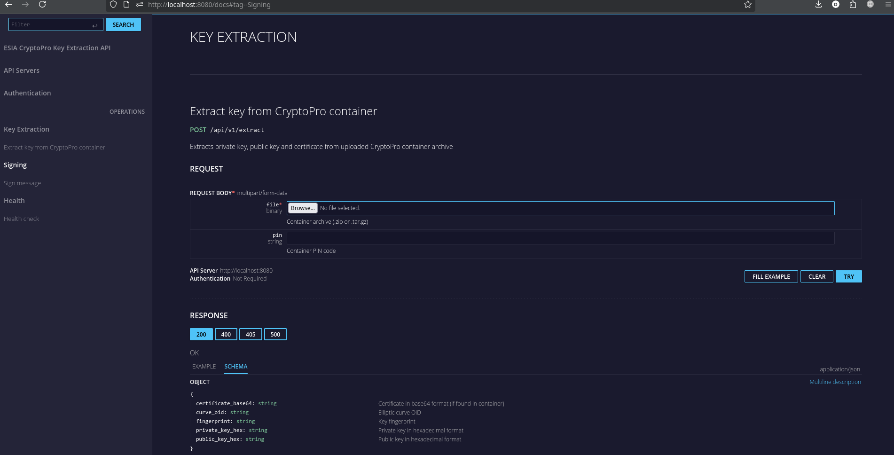

# ESIA oAuth Client for Go

Two versions of README:

🇷🇺 [Русский](README.md) | 🇺🇸 [English](README_en.md)

Native Go implementation of oAuth via ESIA (Russian government authentication service) with GOST cryptography support.
No Docker builds with patched OpenSSL or external OpenSSL dependencies required.

## Table of Contents
- [Features](#features)
- [Prerequisites](#prerequisites)
- [Project Structure](#project-structure)
- [CLI Installation](#cli-installation)
  - [Go](#go)
  - [Build from Source](#build-from-source)
  - [Docker](#docker)
- [Extracting Private Key from CryptoPro Container](#extracting-private-key-from-cryptopro-container)
- [ESIA Client Example](#esia-client-example)
- [HTTP API Server Installation](#http-api-server-installation)
  - [Go](#go-1)
  - [Build from Source](#build-from-source-1)
  - [Docker](#docker-1)
- [ESIA Client Example (via HTTP API)](#esia-client-example-via-http-api)

## Features

- GOST R 34.10-2012 signature (256 bit)
- GOST R 34.11-2012 hash (Streebog-256)
- CMS/PKCS#7 SignedData generation
- CryptoPro container key extraction

## Prerequisites

- Go 1.21+ for building from source
- CryptoPro container with private key and certificate. The term "container" - is just a directory (could be an archive though) created when exporting a key from CryptoPro CSP.

## Project Structure

```
esia-potato/
|--- cms/
|    --- cms.go                   # CMS/PKCS#7 SignedData
|--- cryptopro/
|    --- extract.go               # Key extraction library
|--- httpapi/
|    |--- handlers.go             # HTTP handlers
|    |--- archive.go              # Archive extraction
|    `--- types.go                # Request/response types
|--- utils/
|    --- bytes.go                 # Utility functions
|--- cmd/
|    |--- cryptopro_extract_service/
|    |    --- main.go             # HTTP API server (entry point)
|    |--- cryptopro_extract/
|    |    --- main.go             # CLI for key extraction
|    |--- example/
|    |    --- main.go             # ESIA client example (library)
|    `--- example_api/
|         --- main.go             # ESIA client example (HTTP API)
`--- test_container/              # Test keys (in .gitignore)
```

## CLI Installation

### Go

```bash
go install github.com/LdDl/esia-potato/cmd/cryptopro_extract@latest
cryptopro_extract -h
```

### Build from Source

```bash
git clone git@github.com:LdDl/esia-potato.git --depth 1
cd esia-potato
go run ./cmd/cryptopro_extract -h
```

### Docker

```bash
docker pull dimahkiin/cryptopro-extract:latest
docker run --rm -v $(pwd)/container:/data dimahkiin/cryptopro-extract -p YOUR_PIN /data
```

## Extracting Private Key from CryptoPro Container

CryptoPro container stores keys in a proprietary format encrypted with [GOST 28147](https://en.wikipedia.org/wiki/GOST_(block_cipher)).

- Using the installed CLI:
  ```bash
  cryptopro_extract -p YOUR_PIN_PASSWORD ./container.000
  ```

- Or from source:
  ```bash
  go run ./cmd/cryptopro_extract -p YOUR_PIN_PASSWORD ./container.000
  ```

If successful, the console output will look like:

```
{"time":"2025-12-29T20:36:00.591340886+03:00","level":"INFO","msg":"container opened","path":"./test_container","curve_oid":"1.2.643.2.2.36.0"}
{"time":"2025-12-29T20:36:01.065829042+03:00","level":"INFO","msg":"primary key extracted","curve_oid":"1.2.643.2.2.36.0","fingerprint":"0123456789abcdef","private_key":"a1b2c3d4e5f6a7b8c9d0e1f2a3b4c5d6e7f8a9b0c1d2e3f4a5b6c7d8e9f0a1b2"}
{"time":"2025-12-29T20:36:01.065854001+03:00","level":"WARN","msg":"secondary key found but not extracted","masks":"masks2.key","primary":"primary2.key"}
{"time":"2025-12-29T20:36:01.065858097+03:00","level":"INFO","msg":"done"}
```

If you see a warning message:
```
secondary key found but not extracted
```
this is normal - the secondary key is not needed for signing, as ESIA oAuth only uses the primary key.

Now you have the private key to use for signing ESIA requests.

## ESIA Client Example

- Take the private key from the previous step output and paste it into `cmd/example/main.go` in `keyHex`.
- Run the example:
  ```bash
  go run ./cmd/example/main.go
  ```

If successful, the console output will look like:
```
{"time":"2025-12-29T20:47:23.876107574+03:00","level":"INFO","msg":"message prepared","message":"openid2025.12.29 17:47:23 +0000775607_DP0f9439ef-3581-4de5-9b8c-d20135960331"}
{"time":"2025-12-29T20:47:23.878111012+03:00","level":"INFO","msg":"signature created","signature_bytes":2927,"base64_chars":3904}
{"time":"2025-12-29T20:47:23.8781677+03:00","level":"INFO","msg":"authorization URL prepared","url":"https://esia-portal1.test.gosuslugi.ru/aas/oauth2/ac?access_type=offline&client_id=775607_DP&client_secret=huge_jwt_token&redirect_uri=https%3A%2F%2Fya.ru&response_type=code&scope=openid&state=0f9439ef-3581-4de5-9b8c-d20135960331&timestamp=2025.12.29+17%3A47%3A23+%2B0000"}
{"time":"2025-12-29T20:47:23.878185114+03:00","level":"INFO","msg":"testing against ESIA"}
{"time":"2025-12-29T20:47:23.95390256+03:00","level":"INFO","msg":"response received","status":"302 ","location":"https://esia-portal1.test.gosuslugi.ru/login"}
{"time":"2025-12-29T20:47:23.953918261+03:00","level":"INFO","msg":"signature accepted by ESIA"}
```

A redirect to /login means the signature passed verification and everything is OK.

## HTTP API Server Installation

For some scenarios it is easier to deploy an HTTP API server that allows extracting keys and signing messages via REST API.

### Go

```bash
go install github.com/LdDl/esia-potato/cmd/cryptopro_extract_service@latest
cryptopro_extract_service -host 0.0.0.0 -port 8080
```

### Build from Source

```bash
go run ./cmd/cryptopro_extract_service/main.go -host 0.0.0.0 -port 8080
```

### Docker

```bash
docker pull dimahkiin/cryptopro-extract-service:latest
docker run -p 8080:8080 dimahkiin/cryptopro-extract-service
```

### API Documentation

Interactive API documentation is available at:
- **OpenAPI JSON:** http://localhost:8080/docs/swagger.json
- **UI (RapiDoc):** http://localhost:8080/docs

  

- [RapiDoc](https://rapidocweb.com/) - UI for API documentation

### Endpoints

#### GET /health

Health check endpoint.

**Example:**
```bash
curl http://localhost:8080/health
```

**Response:**
```json
{"status":"ok"}
```

#### POST /api/v1/extract

Extract key from CryptoPro container.

**Request:** `multipart/form-data`
- `file` - container archive (`.zip` or `.tar.gz`)
- `pin` - container PIN code

**Example:**
```bash
curl -X POST http://localhost:8080/api/v1/extract \
  -F "file=@container.zip" \
  -F "pin=12345"
```

**Response:**
```json
{
  "private_key_hex": "a1b2c3d4...",
  "public_key_hex": "e5f6a7b8...",
  "fingerprint": "0123456789abcdef",
  "curve_oid": "1.2.643.2.2.36.0",
  "certificate_base64": "MIIBkTCB..."
}
```

The `certificate_base64` field contains the certificate from the container (if `certificate.cer` is found). It can be used for signing via `/api/v1/sign`.

#### POST /api/v1/sign

Sign a message using the private key.

**Request:** `application/json`
```json
{
  "private_key_hex": "a1b2c3d4...",
  "certificate_base64": "MIIBkTCB...",
  "message": "text to sign"
}
```

**Example:**
```bash
curl -X POST http://localhost:8080/api/v1/sign \
  -H "Content-Type: application/json" \
  -d '{
    "private_key_hex": "a1b2c3d4...",
    "certificate_base64": "MIIBkTCB...",
    "message": "openid2025.01.01 12:00:00 +0000CLIENT_ID12345"
  }'
```

**Response:**
```json
{
  "signature_base64": "MIIBygYJKoZIhvcNAQc..."
}
```

### Example: Extract Key and Sign

```bash
# 1. Extract key and certificate from container
RESP=$(curl -s -X POST http://localhost:8080/api/v1/extract \
  -F "file=@container.zip" \
  -F "pin=12345")

# 2. Extract fields from response
KEY=$(echo $RESP | jq -r .private_key_hex)
CERT=$(echo $RESP | jq -r .certificate_base64)

# 3. Sign message
curl -X POST http://localhost:8080/api/v1/sign \
  -H "Content-Type: application/json" \
  -d "{
    \"private_key_hex\": \"$KEY\",
    \"certificate_base64\": \"$CERT\",
    \"message\": \"openid2025.01.01 12:00:00 +0000CLIENT_ID12345\"
  }"
```

## ESIA Client Example (via HTTP API)

If you cannot use this project as a library, you can use its HTTP API version.

1. Start the HTTP API server (see above)

2. And then:
   ```bash
   go run ./cmd/example_api/main.go
   ```

This example:
- Sends the container to `/api/v1/extract` to extract the key
- Sends a message to `/api/v1/sign` for signing
- Uses the signature for ESIA authorization
